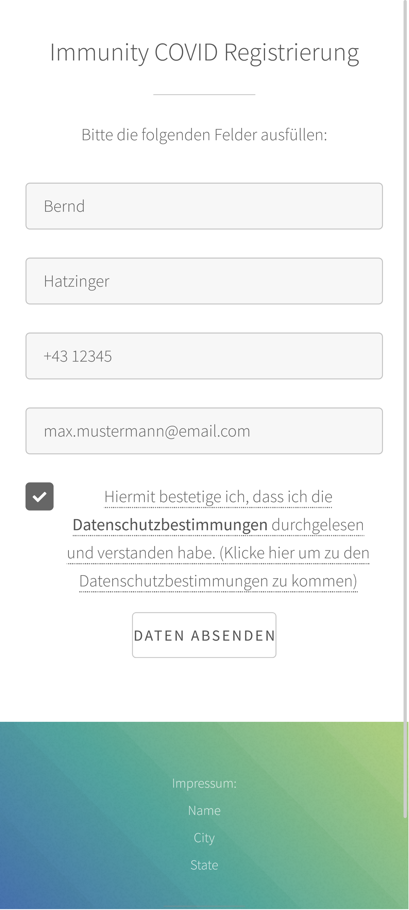

# COVID-Registration

A simple COVID-19 registration website made for an event where 2000 people used this service.

Register page             |  Data protection rules page |  Registered page
:-------------------------:|:-------------------------:|:-------------------------:
  |   |  

## Features
- Does still show the entered information when the user opens the website later again.
- Does not delete or override changed registrations (only marks them in the database as changed...).

## Usage
It is important that the **right permissions** get set for the file db.ini (db.ini = where the database login information is stored),
so that only the server can read and edit this file.

### Database
A MySql database with the following table, called *"Immunity"*, was used.

 
This website uses a template from [html5up](https://html5up.net/).
